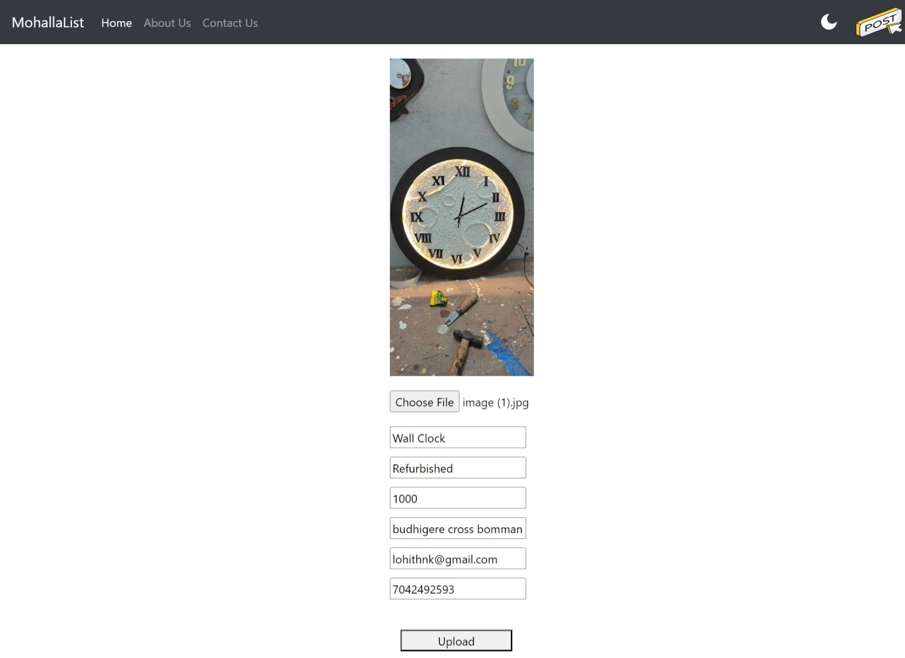

# classified-ad-fullstack
ReactJs, NodeJs and MongoDB based full stack ad publishing website
----------------------
1. Used Redux Store to handle variable such as Dark Mode and Post icon
2. Implemented image preview while upload
3. Data validation is done for each posting
4. Used formidable and form in nodejs and reactjs respectively
--------------------------
Please Note:
1. A simple live server needs to be run (http://localhost:5500) on folder storing images of ads (src/mongodata in this case), using that server only the frontend fetches files
2. mongoDB should be running on localhost:27017
----------------------------

Front Page
----------------------

New Ad Posting
